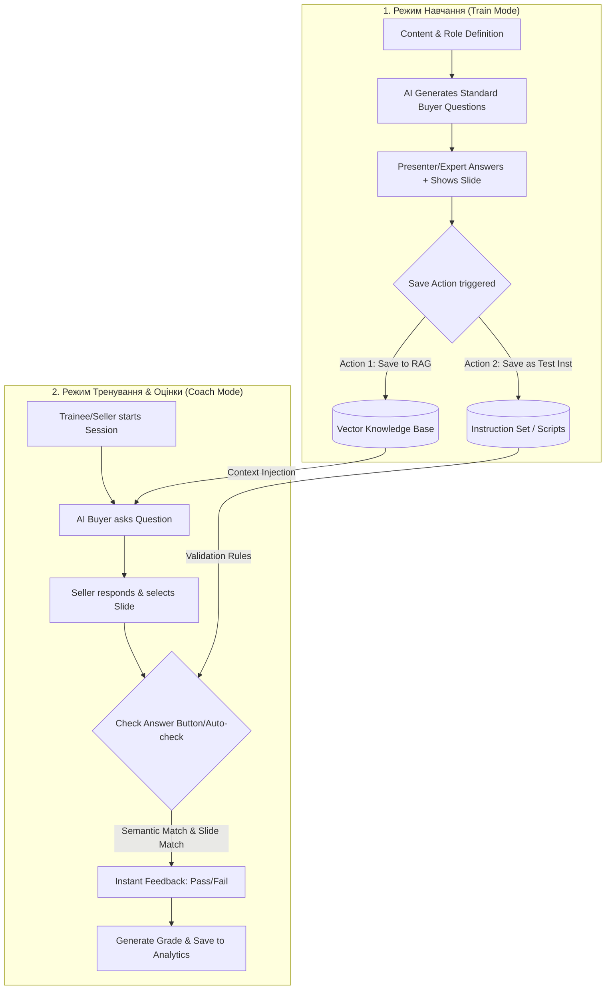

# [EPIC DRAFT] Buyer AI Avatar: Coach & Train Mode

| Метадані | Опис |
| :--- | :--- |
| **Документ** | Epic / PRD Draft |
| **Автор** | Antigravity AI |
| **Статус** | 🔵 Draft / На узгодженні |
| **Дата** | Травень 2026 |

---

## 1. Overview & Context

Цей епік розширює можливості платформи Pitch Avatar, перетворюючи її з інструменту односторонньої презентації на **інтерактивний AI-тренажер для відділів продажів**. 

Презентатор (менеджер з навчання / керівник відділу продажів) може створити **AI-аватара у ролі "Покупця"**. Цей аватар самостійно генерує стандартні запитання на основі вмісту презентації та своєї ролі, а реальний **Слухач-Продавець (Listener/Seller)** повинен взаємодіяти з ним:
*   Відповідати голосом чи текстом.
*   Вибирати та перемикати слайди презентації, що містять правильні відповіді чи візуальні докази.
*   Виявляти потреби, долати заперечення та вести переговори.

Для підготовки такого аватара створюється **"Train Mode" (Режим Навчання)**, де експерт сам відповідає на запитання аватара, а система записує правильні дії (слова та слайди) й зберігає їх у RAG або як інструкції тестування.

---

## 2. Dynamic Workflow Architecture

Наступна діаграма описує взаємодію між Режимом Навчання (Train Mode) та Режимом Оцінювання (Coach Mode):

---

## 3. Product & Technical Clarification Questions

Щоб створити ідеальний технічний дизайн та архітектуру бази даних, нам потрібно відповісти на наступні ключові питання. Вони розділені за категоріями:

### 🧩 3.1. Алгоритм оцінки відповідей (Evaluation & Validation)
1. **Як саме система перевіряє правильність відповіді слухача-продавця?**
   * Чи орієнтуємося ми на **точний збіг вибраного слайду**? (Наприклад, на запитання *"Скільки коштує?"* обов'язково має бути показано слайд `Prices`).
   * Як оцінюється **текст/мова продавця**? Чи це семантична схожість через LLM (Semantic Similarity) із записаною експертною відповіддю, чи ми шукаємо ключові слова/тези?
   * Чи повинні оцінюватися soft-skills (ввічливість, відсутність слів-паразитів, робота з запереченнями)?
2. **Миттєва оцінка ("Check answer"):**
   * Якщо увімкнено чек-бокс "Check answer", чи показує система оцінку відразу після відповіді на *кожне окреме питання*, чи тільки після завершення всього діалогу?

---

### 🏋️ 3.2. Режим Навчання (Train Mode) & RAG
3. **Механіка збереження правильних відповідей:**
   * Що саме зберігається у RAG при натисканні збереження? (Наприклад: `Питання Аватара` + `Правильна відповідь текстом` + `ID слайду, який треба показати`).
   * **"Action (не тригерне) збереження..."** та **"Action (не тригерних) який додає Action"**:
     * Будь ласка, деталізуйте, що мається на увазі під цими діями. Чи це кнопки в інтерфейсі Train Mode для ручного збереження (на відміну від автоматичного збереження за тригером)?
     * Що означає *"Action який додає Action"*? Чи це можливість під час навчання створювати нові кастомні кнопки дій для продавця (наприклад, кнопка *"Запропонувати знижку"* чи *"Записати на демо"*), які потім з'являться в інтерфейсі тестування?

---

### ⚙️ 3.3. Налаштування тренера (Coach Settings)
4. **Масштаб налаштувань:**
   * Де зберігаються параметри `Coach Settings`? Вони є глобальними для всього проекту (презентації), чи створюються індивідуально під кожне `Assignment` (призначення для конкретного продавця)?
5. **Динаміка діалогу:**
   * Чи є сценарій лінійним (наприклад, фіксований список з $N$ запитань), чи він адаптивний (якщо продавець відповів неправильно, аватар заглиблюється в заперечення)?
   * Чи може продавець сам першим задати питання покупцю-аватару, щоб почати виявлення потреб (як у наведеному вами прикладі діалогу про проблеми з показами презентацій)?

---

### 🎨 3.4. UI/UX та Аналітика
6. **Візуалізація підказок ("Show Answer"):**
   * Як саме повинна виглядати правильна відповідь при натисканні "Show Answer"? 
     * Відобразити скрипт текстом під слайдом?
     * Підсвітити правильний слайд у каруселі слайдів?
     * Озвучити правильну відповідь голосом (синтез)?
7. **Аналітика та Звітність:**
   * Чи повинні оцінки сесій інтегруватися в існуючий інтерфейс `Results` модуля HR Onboarding, чи ми створюємо окремий дашборд лідерборду для відділу продажів?

---

## 4. Глибокі уточнюючі питання для User Story (Deep Clarifying Questions)

Для досягнення 100% відповідності вашому баченню інтерактивного тренажера, ми сформулювали наступні уточнюючі питання, розділені на 5 ключових напрямків:

### 🎯 Напрямок 1: Логіка та валідація Гібридного діалогу (Hybrid Dialogue Workflow)
У ваших прикладах діалогів є три різні механіки:
1. **Аватар запитує -> Продавець відповідає** (напр. *"Скільки коштує ваш продукт?"*).
2. **Продавець запитує -> Аватар відповідає** (виявлення болю, напр. *"Привіт, чи є у вас проблема з показом презентацій...?"*).
3. **Гібридний діалог (зміна ініціативи)**: Аватар заперечує (*"це мало. мене це не влаштовує"*), а продавець повертає ініціативу питанням (*"а скільки було б нормально?"*).

*   **❓ Q1.1:** Як AI-мотор оцінювання повинен оцінювати репліки продавця, коли він сам запитує? Що є критерієм "правильного" запитання продавця (семантична відповідність темі виявлення болю, використання відкритих запитань чи щось інше)?
*   **❓ Q1.2:** Чи правильно, що в **Train Mode** експерт може самостійно записати обидва боки діалогу: як очікуване запитання продавця, так і реакцію/відповідь аватара на нього?
*   **❓ Q1.3:** Чи повинен AI-покупець вміти логічно завершувати переговори (наприклад, фразами *"Добре, купую"* або *"Ні, умови нам не підходять"*), якщо продавець досягає високого/низького сумарного балу?

### ⚡ Напрямок 2: Механіка "Action який додає Action" (Dynamic Interactive Buttons)
Ви зазначили вимогу: *"Треба зробити Action (не тригерних) який додає Action."*
*   **❓ Q2.1:** Чи правильно ми розуміємо, що експерт у **Train Mode** може клікнути "Add Action" і створити інтерактивну кнопку швидкої дії (наприклад, кнопка *"Запропонувати знижку 10%"* або *"Запропонувати безкоштовний тріал"*), яка з'явиться на екрані продавця під час проходження тесту?
*   **❓ Q2.2:** Якщо продавець натискає таку кнопку під час реального тренування в Coach Mode, як реагує аватар? Чи експерт у Train Mode прописує текстову реакцію аватара на кожну створену кнопку (наприклад: кнопка *"Знижка 10%"* ➔ аватар відповідає *"Добре, це вже цікавіше"*)?
*   **❓ Q2.3:** Чи мають ці кнопки окремі бали в системі оцінювання (наприклад, правильне використання кнопки додає бонусні бали)?

### 📦 Напрямок 3: RAG проти Тестових Інструкцій
У ТЗ є дві вимоги збереження:
- *"збереження правильних відповідей у RAG"*
- *"збереження правильних відповідей як інструкції тестування з параметрами"*

*   **❓ Q3.1:** Чим принципово відрізняється поведінка аватара в цих двох випадках?
    *   *Варіант:* Збереження як **Інструкції** створює жорсткий, лінійний сценарій тестування (крок за кроком, фіксовані питання та відповіді).
    *   *Варіант:* Збереження у **RAG** дозволяє аватару вільно спілкуватися з продавцем на будь-які теми, використовуючи збережені знання для генерації відповідей.
    Чи вірне таке розділення?
*   **❓ Q3.2:** Які саме параметри ви маєте на увазі під фразою *"як інструкції тестування з параметрами"*? Чи це прохідний бал, вага питання, часові ліміти чи обов'язкові ключові слова?
*   **❓ Q3.3:** Що робити при повторному навчанні (якщо експерт відповідає інакше на те саме запитання)? Ми перезаписуємо стару відповідь у RAG/інструкціях, чи додаємо її як альтернативно-правильну (обидва варіанти зараховуються)?

### 🖥️ Напрямок 4: UI/UX та поведінка кнопок у Train Mode
Ви вказали, що кнопки **"Show Answer"** та **"Check Answer"** мають бути присутніми і в **Train Mode**.
*   **❓ Q4.1:** Для чого експерту кнопка "Show Answer" під час *навчання* аватара? Чи це для перевірки поточної бази знань аватара (щоб подивитись, як аватар відповідав раніше, перед тим як записувати нову правильну відповідь)?
*   **❓ Q4.2:** Коли учень натискає "Show Answer" у реальному **Coach Mode**, чи анулюються бали за поточний крок, чи нараховується якийсь штрафний відсоток (наприклад, лише 50% балів)?
*   **❓ Q4.3:** При натисканні "Show Answer", чи повинна система автоматично перемикати слайд презентації на правильний у плеєрі продавця, чи просто підсвічувати його як підказку в каруселі знизу?

### 👥 Напрямок 5: Персони покупців та масштабованість
*   **❓ Q5.1:** Чи повинен користувач мати можливість обрати характер/тип покупця у Coach Settings (наприклад: *"Скептичний покупець"* — частіше заперечує, *"Технічний спеціаліст"* — вимагає детальних специфікацій, *"Бюджетний контролер"* — фокусується лише на цінах)?
*   **❓ Q5.2:** Чи повинна система підтримувати створення декількох різних сценаріїв для однієї презентації (наприклад: *"Сценарій 1: Перше знайомство"*, *"Сценарій 2: Обговорення комерційної пропозиції"*), чи для однієї презентації існує лише один глобальний тренувальний профіль?
*   **❓ Q5.3:** Якщо ліміт питань `max_questions` добіг кінця, але діалог все ще триває (наприклад, у гібридному режимі), чи повинен аватар штучно завершувати розмову, чи сесія продовжується до логічного кінця?
