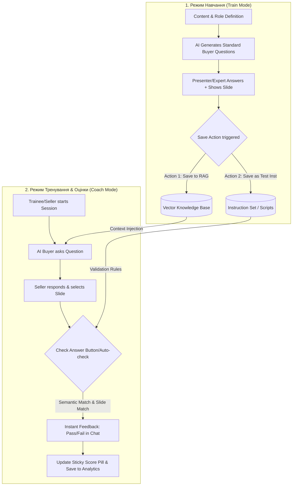

# [EPIC DRAFT] Buyer AI Avatar: Coach & Train Mode

| Метадані | Опис |
| :--- | :--- |
| **Документ** | Epic / PRD Draft |
| **Автор** | Antigravity AI |
| **Статус** | 🔵 Draft / Оновлено на базі мокапів |
| **Дата** | Липень 2026 |

---

## 1. Overview & Context

Цей епік розширює можливості платформи Pitch Avatar, перетворюючи її з інструменту односторонньої презентації на **інтерактивний AI-тренажер для відділів продажів**. 

**Основна термінологія:**
*   **Buyer / Покупець (AI Аватар):** Проактивний ШІ, що відіграє роль клієнта. Задає питання відповідно до вибраної *Ролі/Use Case* (з існуючого конструктора ролей).
*   **Seller / Продавець (Учень):** Співробітник, який проходить тренування (Coach Mode). Відповідає на питання аватара голосом чи текстом, а також може *опціонально* демонструвати релевантні слайди презентації.
*   **Trainer / Тренер (Експерт):** Адміністратор, що налаштовує систему в *Train Mode*. 

Після узгодження нових мокапів (Phase 3), стратегія реалізації розділена на **Основну нову реалізацію** (розширений LMS-подібний підхід) та **Альтернативний сценарій** (спрощений MVP).

---

## 2. Нова реалізація (Основна стратегія)

Розробка розбивається на три ключові етапи на основі затверджених мокапів.

### 🌊 Етап I: Wizard + Editor
1. **Coach Avatar Toggle (Wizard Step 3):** Додано перемикач Coach Mode на етапі створення аватару + обов'язковий вибір "Ролі учня" (Account Executive, Sales Manager тощо).
2. **Coach Q&A tab у редакторі:** Нова вкладка в правій панелі для роботи з тестовими завданнями.
3. **AI генерація Q&A (CoachQASetPanel):** Окрема панель генерації питань з налаштуваннями кількості, складності та типу (Pricing, Objection і т.д.). Підтримка drag & drop контенту з Knowledge Base.

### 🌊 Етап II: Listener + Settings
1. **Listener Coach Mode (Train Mode):** 
   - **Editor Preview:** Режим для тренера з можливістю тестувати питання ("AI asks") або вводити діалог вручну ("Manual").
   - **Listener View:** Зворотний зв'язок як повідомлення у чаті після кожної відповіді, та постійний плаваючий Score pill (поточний бал) зверху чату.
2. **Coach Settings Panel:** Налаштування таймінгу (на слайдах, до, після), чекбокси фідбеку, та Passing score.
3. **Quiz Mode:** Можливість тренування виключно через питання-відповіді без використання слайдів взагалі.

### 🌊 Етап III: Advanced
1. **Slide-as-answer:** Відповідь на питання шляхом вибору правильного слайду.
2. **4 Режими тренування:** Матриця взаємодії (Аватар розповідає / запитує, Учень розповідає / запитує).
3. **Custom Roles:** Можливість тренерів створювати кастомні ролі для учнів.

---

## 3. Альтернатива (Спрощений варіант)

Цей варіант зберігається як резервний для швидкого тестування гіпотези (MVP) без створення складної Q&A інфраструктури.

*   **Ініціалізація:** Чекбокс "Coach Project" знаходиться безпосередньо на кроці "Instruction" у Візарді (без вибору складної ролі учня).
*   **Індикація:** В списку проектів з'являється іконка "Гантельки" + базовий фільтр.
*   **Налаштування Q&A:** На слайдах доступний простий вибір — ставити питання рандомно або використовувати заданий порядок з готової бази текстів, без просунутих AI-генерацій та Quiz режимів.

---

## 4. Dynamic Workflow Architecture (Основна реалізація)

---

## 5. Product & Technical Clarification Questions

Наступні питання залишаються відкритими для подальшого технічного проектування backend-частини (оцінювання та збереження логіки):

### 🧩 5.1. Алгоритм оцінки відповідей (Evaluation & Validation)
1. **Як саме система перевіряє правильність відповіді слухача-продавця?**
   * Чи орієнтуємося ми на **точний збіг вибраного слайду**?
   * Як оцінюється **текст/мова продавця**? Чи це семантична схожість через LLM (Semantic Similarity) із записаною експертною відповіддю, чи ми шукаємо ключові слова/тези?
   * Чи повинні оцінюватися soft-skills (ввічливість, відсутність слів-паразитів, робота з запереченнями)?

### 🏋️ 5.2. Режим Навчання (Train Mode) & RAG
2. **Механіка збереження правильних відповідей:**
   * Що саме зберігається у RAG при натисканні збереження? (Наприклад: `Питання Аватара` + `Правильна відповідь текстом` + `ID слайду, який треба показати`).
   * **"Action (не тригерне) збереження..."** та **"Action (не тригерних) який додає Action"**:
     * Що означає *"Action який додає Action"*? Чи це можливість під час навчання створювати нові кастомні кнопки дій для продавця (наприклад, кнопка *"Запропонувати знижку"* чи *"Записати на демо"*), які потім з'являться в інтерфейсі тестування?

### ⚙️ 5.3. Налаштування тренера (Coach Settings)
3. **Масштаб налаштувань:**
   * Де зберігаються параметри `Coach Settings`? Вони є глобальними для всього проекту (презентації), чи створюються індивідуально під кожне `Assignment` (призначення для конкретного продавця)?
4. **Динаміка діалогу:**
   * Чи є сценарій лінійним (наприклад, фіксований список з N запитань), чи він адаптивний (якщо продавець відповів неправильно, аватар заглиблюється в заперечення)?
