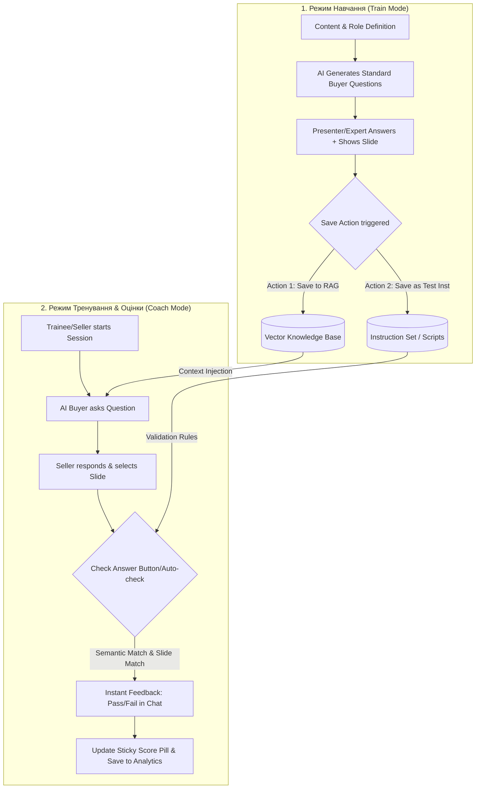

# [EPIC] Buyer AI Avatar: Coach & Train Mode (Phase 3)

| Метаданные | Описание |
| :--- | :--- |
| **Документ** | Epic / PRD |
| **Статус** | 🟢 Утверждено (Макеты финализированы в Figma) |
| **Дата** | Июль 2026 |

---

## 1. О проекте (Context & Goals)

Мы расширяем платформу Pitch Avatar новым модулем Coach — интерактивным AI-тренажёром для команд продаж. Модуль позволяет тренерам (PM / Admin) активировать Coach Mode при создании аватара, генерировать Q&A с помощью AI и настраивать параметры тренировки. А продавцы (слушатели) проходят тренировки с AI-аватаром в роли покупателя.

**Техническое ограничение первого этапа (Важно!):** 
Аватар не управляет слайдами за пользователя автоматически. AI-генерация Q&A работает в отдельном scope `coach_qa` и не смешивается с основной Knowledge Base. В Wizard изменения на step 3 должны быть минимальными — только добавление чекбокса и условный рендеринг шагов 4 и 5. Кнопка генерации Q&A по слайду в самом редакторе удаляется, вся генерация переносится в Wizard Step 4.

**Бизнес-цель:** 
Превратить Pitch Avatar в полноценную Sales Coaching Platform, сделать онбординг новых сейлзов/сотрудников структурированным, измеримым и масштабируемым.

**Основная терминология:**
*   **Buyer / Покупатель (AI Аватар):** Проактивный ИИ, отыгрывающий роль клиента. Задает вопросы соответственно выбранной роли.
*   **Seller / Продавец (Ученик):** Сотрудник, проходящий тренировку. Отвечает на вопросы аватара (голос/текст) и опционально показывает слайды.
*   **Trainer / Тренер (Эксперт):** Администратор, настраивающий систему в Train Mode.

---

## 2. Где это находится и референсы

Элементы распределены по веб-приложению:
*   Список проектов (`/projects`)
*   Wizard создания аватара (`/projects/new`, шаги 3, 4, 5)
*   Редактор проекта (`/projects/[id]/edit`, верхнее меню, правая панель и Preview)

**Ссылки и референсы:**
*   **Рабочий прототип:** [https://pitch-avatar-lab.vercel.app/](https://pitch-avatar-lab.vercel.app/)
*   **Презентация Павла по Coach:** [Google Slides](https://docs.google.com/presentation/d/1i9bX3uKHsTnN9uUr8nl6GF8yXGhJkHt2/edit?slide=id.p1#slide=id.p1)
*   **Дизайн (Бейзлайн):** Строится на реальных экранах продукта (не wireframes). За основу берутся существующие компоненты и токены (`--primary`, `--fill-blue`, `--stroke-blue`, `--status-*`).

---

## 3. Что нужно реализовать (Scope of Work)

### Блок 1: Список проектов (Project List)
*   **Колонка Mode:** Добавить новую колонку рядом с `Type`. Для Coach-проекта — значок «Coach» и иконка гантели 🏋 (accent color). Для обычного — дефис «—».
*   **Фильтр Mode:** Dropdown-фильтр вверху (All / Coach / Standard). При выборе Coach отображаются только Coach-проекты.

### Блок 2: Wizard Step 3 (Coach Mode Checkbox)
*   **Checkbox «Coach Mode»:** При активации разворачивается Learner Role Selector и меняется левый sidebar.
*   **Sidebar:** Добавляются 2 новых шага (2 Coach Q&A Set и 3 Coach Settings), выделенных янтарным цветом (amber). Шаг Knowledge Base смещается на позицию 6.

### Блок 3: Wizard Step 4 (Coach Q&A Set — NEW)
Новый шаг визарда (scope `coach_qa`).
*   **Контент для тестов:** Интерфейс Базы Знаний (KnowledgeBaseUI), интегрированный напрямую (Файл, Ссылка, Текст, Drag & Drop Google Drive).
*   **Параметры генерации:**
    *   Amount (Количество вопросов).
    *   Difficulty (Easy/Medium/Hard).
    *   Language (Новое поле: English и т.д.).
    *   Topic (Мультиселект/чипы: Price, Objection, Technical...).
    *   Кнопка 🤖 `Generate & add to Set`.
*   **Test Set:** Таблица/карточки Q&A. Кнопки `Edit`, `Delete`, `+ Add manually` (модалка), `Import CSV`.

### Блок 4: Wizard Step 5 (Coach Settings — NEW)
*   **Test Format:** Text / voice, Text + correct slide, Only correct slide.
*   **Test Set Selection:** Категории с чекбоксами + количество вопросов.
*   **Question Timing:** Before / On slides / After. (Скрывается, если нет презентации).
*   **Session Time Limit:** Поле ввода минут.
*   **Question Order:** Sequential / Random N.
*   **Display Flags:** Панель с чекбоксами (Evaluate immediately, Show correct answer, Show current score constantly, Show remaining questions).
*(Passing Score и Reporting перенесены в Epic Enrollments).*

### Блок 5: Editor — Top Nav и Правая панель
*   **Top Navigation:** Вкладки `Coach Q&A Set` и `Coach Settings` (открывают интерфейс из Wizard).
*   **Coach Q&A Tab (Правая панель):** Точечное управление вопросами для выбранного слайда (стрелки ↑ / ↓, удаление ×). Кнопка `+ Add Q&A from Set` (шторка выбора готовых вопросов вместо генерации).
*(Глобальные настройки Ask Order убраны отсюда в Coach Settings).*

### Блок 6: Editor Preview / Train Mode (AI asks)
Тиндероподобная модерация:
*   **Train Mode Banner:** Sticky top с переключателем 🤖 AI asks ↔ Manual и счетчиком наполнения.
*   **Генерация:** Loader "Analyzing slide context...".
*   **Модерационная карточка:**
    *   Теги, Question, Recommended Answer (эталон).
    *   Кнопки: ❌ `Reject` (генерирует заново), ✏️ `Edit`, ✅ `Approve`.
*   **Обратная связь:** Auto-hide badge `✓ SAVED` и переход к следующей карточке.
*   **Recently Added:** Список последних сохраненных.

### Блок 7: Editor Preview / Train Mode (Manual)
*   **Форма ввода:** Question, Correct Answer (Textareas), Category, Difficulty.
*   **Actions:** `+ Add to Test Set (Q[X])`, `Clear`.
*   **Recently Added:** Хронологический список с быстрыми действиями `Edit` и `Delete` при наведении (hover).

### Блок 8: Coach Session (Режим тренировки)
*   **Триггеры запуска (Session Triggers):**
    *   *Ручной запуск (Manual):* Кнопка `Start practice` / `Start test` после самостоятельного изучения материалов.
    *   *Событийный запуск (Event-based):* Автоматический старт при достижении определенного слайда (к которому привязаны вопросы) или после завершения проигрывания видео на слайде.
*   **Управление сессией (Lifecycle & Pause):**
    *   *Гибкий режим:* Кнопка `Stop test`, позволяющая поставить таймер и сессию на паузу. Пользователь может вернуться к просмотру слайдов или задать уточняющие вопросы Аватару в обычном режиме чата, после чего нажать `Continue test`, чтобы продолжить.
    *   *Строгий режим (Hard Timeout):* Поведение регулируется настройками. Таймер (например, 5 минут) идет без возможности паузы. Если время вышло, а ответы не даны — тест считается проваленным.
*   **Начальный экран:** Заглушка "The avatar will ask questions sequentially..." с кнопкой `Start practice`.
*   **Avatar Video:** Закреплено в верхней части.
*   **Progress & Score Tracker:** Sticky-панель (например, ⚙️ 1/5 · 0%).
*   **Чат:** Вопрос от Аватара. Панель ввода (текст / голос 🎤).
*   **Real-time AI Feedback:** Карточка оценки с вердиктом (цветовое кодирование), Suggested Answer и Feedback (Critique). Затем аватар задает следующий вопрос.
*   **Session Complete (Результаты сессии):** Экран итогов, который появляется после ответа на все вопросы. Включает общий балл в процентах (успех/провал), количество правильных ответов, средний балл, детальный разбор (Your answers) со списком всех вопросов, ответов пользователя и их оценками (0/100). Также содержит кнопки `Try again` для перезапуска сессии и `Exit` для выхода.
*   **Хранение состояния (State Storage):** Состояния `started`, `paused`, текущее время таймера и прогресс сохраняются в БД. Система должна различать текущую (продолжающуюся) попытку и старт абсолютно новой попытки тренировки.

---

## 4. Definition of Done для Дизайна
✅ Отрисован Project List с колонкой Mode (🏋 / —) и dropdown-фильтром.
✅ Отрисован Wizard Step 3: чекбокс Coach Mode, Learner Role Selector, и 2 состояния sidebar (выкл./вкл. с янтарными новыми шагами).
✅ Отрисован Wizard Step 4: источник контента, параметры генерации, Test Set (состояния: пусто, loading, список Q&A).
✅ Отрисован Wizard Step 5: Test Type, выбор Q&A, тайминг, три флага, Passing Score, чекбоксы отчётности.
✅ Отрисован Editor: пункты в Top Nav и Coach Q&A вкладка в правой панели.
✅ Отрисован Editor Preview / Train Mode (AI asks): Начальный экран (Ready for practice), banner, sub-toggle, диалог с карточками оценки (Real-time AI Feedback) и бейдж «✓ SAVED».
✅ Отрисован экран Session Complete (результаты сессии): итоговый процент с цветовым кодированием, краткая статистика, список вопросов с ответами пользователя и оценками, кнопки действий.
✅ Отрисован Editor Preview / Train Mode (Manual): форма ввода и список недавних.
✅ Макеты финализированы в Figma, построены на реальных компонентах продукта, готовы к передаче в разработку.

---

## 5. Dynamic Workflow Architecture

