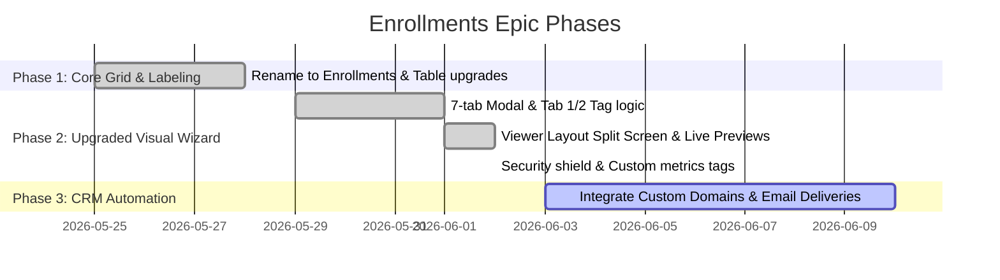

# Epic PRD: Enrollments (Technical: Enrollments)

## 1. Overview

**Epic Name**: Enrollments (Technical Table/Route: `enrollments`)  
**Product Owner**: @yevhen.shaforostov  
**Based on**: CEO Notes & Mockup Layouts (Create & Edit Dialog Wizard)  
**Status**: In Progress / Active Development  

### 1.1. Description

Разработка и внедрение новой концепции **Enrollments (Назначения)**, заменяющей устаревший раздел *Links*. Эпик охватывает создание единого полнофункционального центра управления распределением контента, где презентации (*Projects*) или комплексные курсы (*Courses*) связываются с конкретными слушателями (*Listeners*) или учебными группами (*Groups*). 

Раздел **Enrollments** в интерфейсе имеет просторный **7-вкладочный модальный мастер** (`max-width: 1040px`, `height: 90vh`), разделенный на подробные логические шаги. Он позволяет настраивать шаблоны писем, расписание отправки, уникальные визуальные слои брендированного плеера с «живым» превью, параметры защиты от фрода и интеллектуальные метрики результатов прохождения.

### 1.2. Business Value

*   **Премиальный UX/UI**: Уход от узких боковых слайдеров к просторному адаптивному модальному оверлею повышает удобство работы с комплексными настройками.
*   **Гибкое Брендирование и Слой Плеера**: Точечная настройка контроллеров слайдов, отображения аватара и чата с мгновенным визуальным откликом в превью-плеере.
*   **Повышенная Защита (Anti-Fraud)**: Инструменты капчи, трекинга фокуса и биометрического контроля лица снижают риски фальсификации результатов тестирования.
*   **Глубокая Персонализация Результатов**: Подключение кастомных бизнес-метрик (Visited, Time Spent, Completion %, Test Score) позволяет отслеживать прогресс в CRM/ATS в реальном времени.

### 1.3. Product Structure & Flow

*   **Sidebar Navigation**: Переименование пункта меню **Links** в **Enrollments** (с сохранением роута `/enrollments`).
*   **Главная Таблица**: Отображение ключевых колонок: *Name, Listener / Group, Project / Course, Target Type, Content Type, Status, Link, Progress, Video Recording, Start Date, Time Spent, Score*.
*   **Интерактивный 7-вкладочный модальный мастер создания / редактирования**:
    1.  **General (Общие)**: Выбор названия назначения, типа получателя (Слушатель, Группа, Анонимно), выбор презентации, добавление нескольких Presenters (в виде тегов-писем), HubSpot URL бронирования календаря, дата старта и опции запуска плеера после бронирования.
    2.  **Invitation and Reminders (Приглашение и напоминания)**: Тема и тело письма-приглашения. Поддержка вставки переменных-клише (`#Listener First Name#`, `#Avatar Name#` и др.) по клику на теги-баджи, автоматический перевод на язык получателя, отправка анимированного GIF, планирование даты/времени доставки и логика напоминаний.
    3.  **Links (Ссылки доступа)**: Блок генерации веб-ссылки назначения, скачивания QR-кода доступа и HTML iframe-эмбеда. Доступен после сохранения формы.
    4.  **Viewer Layout (Слой плеера)**: Двухколоночный split-экран. Слева — 20+ выключателей контроллеров слайдов, отображения аватара спикера, интерактивного чата и кнопок действий. Справа — интерактивное живое превью плеера (`.playerMock`), мгновенно перестраивающее сетку, положение и размеры блоков (Avatar & Chat Ratios) в реальном времени.
    5.  **Advanced (Дополнительно)**: Слайд-фид в боковой панели, скачивание PDF, субтитры на основе Speech-to-Text, скрытие превью от анонимов, уровень детализации аватара и стартовый слайд.
    6.  **Security & Verification (Безопасность и Верификация)**: Защитный экран с 4 тогглами: *Human Detection* (капча), *Anti-Fraud* (активность вкладки), *Identity Verification* (селфи/ID), *Anti-Impersonation* (биометрия лица).
    7.  **Results (Настройка результатов)**: Запись сессий, триггеры отправки результатов, Q&A таймеры и панель **Custom Results** с searchable-каталогом метрик для гибкого переопределения.

---

## 2. Completion Criteria

### 2.1. Definition of Ready (DoR)

*   [x] Figma-макеты для всех 7 вкладок модального окна и табличной сетки утверждены.
*   [x] Спроектирована схема метаданных `emailSchedule` в PostgreSQL для хранения расширенных настроек безопасности (`security`) и результатов (`results`).
*   [x] Описан механизм реактивного живого превью плеера на стороне клиента.

### 2.2. Definition of Done (DoD)

*   [x] Таблица и боковое меню переименованы в **Enrollments**; роутинг `/enrollments` сохранен.
*   [x] Модальный оверлей расширен до `1040px` с поддержкой всех 7 разделов настроек.
*   [x] Реализована вставка переменных в тело письма по клику на баджи-теги.
*   [x] Разработан split-экран Viewer Layout с работающим интерактивным превью-плеером.
*   [x] Добавлена вкладка Security & Verification с 4 тогглами фрод-защиты.
*   [x] Реализован searchable-каталог Custom Results для быстрого добавления метрик в виде тегов.
*   [x] Все 4 автоматических Jest-теста успешно пройдены (`npm test` завершается со статусом SUCCESS).
*   [x] Изменения интегрированы с серверными экшенами `createEnrollment` и `updateEnrollment`.

---

## 3. User Stories (US)

### US-01: Enrollments Dashboard Grid (User)
Как менеджер, я хочу видеть полный список назначений с отслеживанием прогресса, даты начала и признаков записи сессии, чтобы быстро оценивать вовлеченность.
*   *Acceptance Criteria*:
    *   Заголовок страницы — **Enrollments**.
    *   Реализованы фильтры по статусам и когортам групп.
    *   Действия в строке свернуты в выпадающее меню **Settings Gear button**.

### US-02: Viewer Layout Split Preview (User)
Как дизайнер контента, я хочу настраивать интерфейс плеера для слушателя (включать/выключать элементы управления, позиционировать чат и аватар, регулировать их высоту) и видеть живой результат, чтобы создавать уникальный брендированный опыт.
*   *Acceptance Criteria*:
    *   Вкладка Viewer Layout разделена на 2 колонки.
    *   Движение ползунка Avatar Height мгновенно масштабирует блок аватара в mockup-плеере справа.
    *   Переключатель Avatar Position переносит панель чата и видео спикера (влево/вправо) в превью.

### US-03: Security & Verification Shield (User)
Как инструктор по комплаенсу, я хочу включать биометрическую верификацию и контроль активности вкладки для критически важных тестов, чтобы гарантировать честное прохождение.
*   *Acceptance Criteria*:
    *   На вкладке Security & Verification отображается синяя иконка Shield.
    *   Доступны 4 переключателя: Human Detection, Anti-Fraud, Identity Verification, Anti-Impersonation.
    *   Выбранные параметры безопасности успешно сериализуются в `emailSchedule.security`.

### US-04: Custom Results Catalog (User)
Как рекрутер, я хочу гибко настраивать цели прохождения (например, следить за просмотрами слайдов или процентом завершения курса) и переопределять их для каждого назначения индивидуально.
*   *Acceptance Criteria*:
    *   Вкладка Results содержит панель **Custom Results**.
    *   Клик на "+ Add result" открывает searchable-дропдаун с поисковым инпутом.
    *   Ввод текста в инпут фильтрует доступные метрики (Visited, Test Score и т.д.) по имени и описанию.
    *   Выбранные метрики отображаются в виде удаляемых баджей.

---

## 4. Implementation Phases

### Phase 1: Базовый UI и переименование (Спринт 1) [COMPLETED]
*   Переименованы ярлыки бокового меню Links -> Enrollments.
*   Главная таблица дополнена новыми столбцами, внедрено действие Settings Gear.
*   Добавлены mock-данные для визуального тестирования.

### Phase 2: Визуальный Мастер и Интерактивные Вкладки (Спринт 2) [COMPLETED]
*   Модальное окно переведено на сетку `max-width: 1040px`.
*   Реализована логика добавления Presenters-тегов и вставка заполнителей по клику на вкладке Invitation.
*   Разработан split-экран Viewer Layout с интерактивным живым mockup-плеером на клиенте.
*   Внедрены вкладки Security & Verification и Results с searchable-поиском по каталогу целей.
*   Написаны и успешно выполнены Jest-тесты для верификации монтирования и кликов по вкладкам.

### Phase 3: CRM Интеграции и Email-домены (Спринт 3) [IN PROGRESS]
*   Интеграция с внешними SMTP/Resend шлюзами для отправки приглашений по крону.
*   Подтверждение кастомных доменов на стороне администратора.
