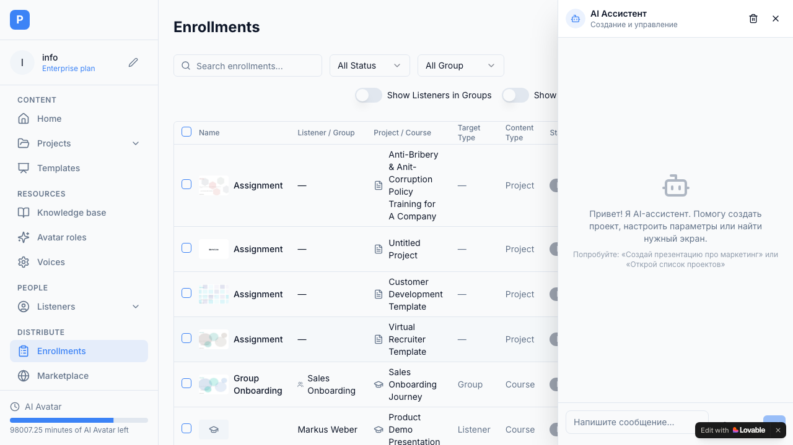
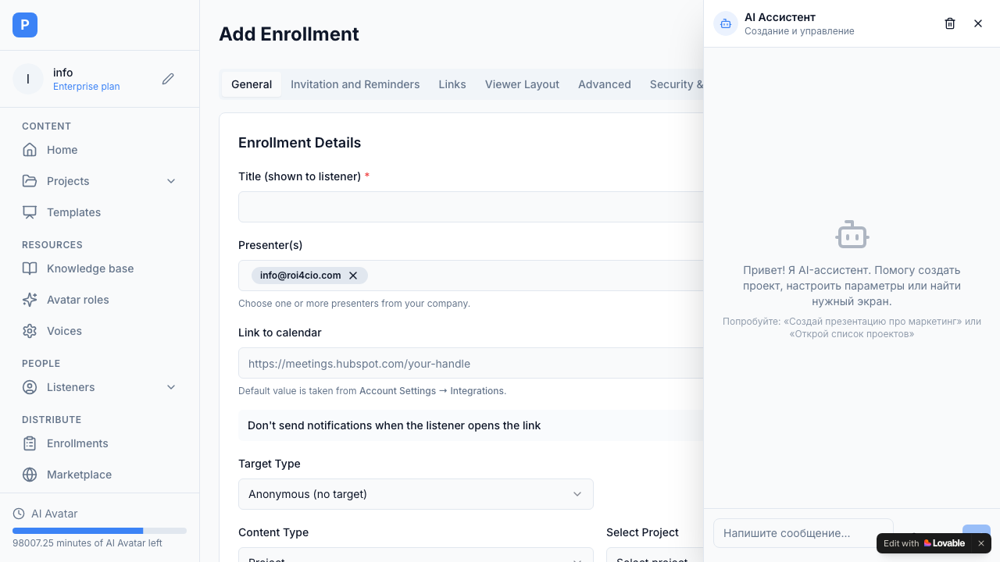

# Epic PRD: Enrollments Quota Setting, Control & Billing

## 1. Overview

**Epic Name**: Enrollments Quota Setting, Control & Billing (ранее Listeners Seats)
**Author**: Paul Zhdanovych
**Based on**: [Listeners Seats Setting Control Billing - Listeners Assignments](https://roi4cio.atlassian.net/wiki/spaces/pitchavatar/pages/1562542170/Listeners+Seats+Setting+Control+Billing+-+Listeners+Assignments)

### 1.1. Description
Задание администратором и автоматический контроль максимально возможного одновременного количества слушателей с назначениями (Enrollments Quota). Включает контроль при создании новых назначений, предупреждение пользователя при превышении лимита, а также функционал заказа и биллинга дополнительных мест.

### 1.2. Business Value
За использование большего количества Enrollments (назначений) нужно делать больше аналитики и отправлять больше приглашений. Следовательно, необходимо монетизировать превышение лимитов и просить пользователей оплачивать дополнительные квоты.

### 1.3. Product Structure & Flow
- **Клиент (Client Dashboard)**: [Pitch Avatar Lab - Enrollments](https://pitch-avatar-lab.vercel.app/enrollments)
- **Админка (Superadmin Panel)**: [Pitch Avatar Admin - Users](https://pitch-avatar-admin.vercel.app/users)
- **Админка (Superadmin)**: Возможность вручную задавать квоту (Enrollments Quota) для конкретного пользователя.
- **Процесс создания Enrollment**: При создании Share/Assignment система проверяет доступный лимит. Если лимит превышен — блокировка создания и показ попапа с предложением докупить места или удалить старые назначения.
- **Биллинг (Покупка)**: Пользователь может докупить дополнительные места. До 100 мест цена составляет 10 USD за слушателя в месяц, более 100 мест — 8 USD за слушателя в месяц.

---

## 2. Screenshots & UI References (Скриншоты интерфейса)

Ниже приведены ключевые экраны интерфейса управления назначениями и контроля квот.

### 2.1. Панель назначений (Enrollments Dashboard)
Здесь отображается список всех активных и завершенных назначений с текущим статусом.


### 2.2. Конфигурация нового назначения (Add Enrollment)
Форма создания нового назначения, при сохранении которой срабатывает автоматическая валидация доступных мест.


---

## 3. Database Schema (Схема Базы Данных)

Для контроля квот используется таблица `listener_seats`, хранящая ограничения для каждого пользователя.

```sql
CREATE TABLE IF NOT EXISTS public.listener_seats (
    id UUID DEFAULT gen_random_uuid() PRIMARY KEY,
    user_id UUID DEFAULT '00000000-0000-0000-0000-000000000000'::uuid NOT NULL UNIQUE,
    max_seats INTEGER DEFAULT 100 NOT NULL,
    active_count INTEGER DEFAULT 0 NOT NULL,
    created_at TIMESTAMPTZ DEFAULT NOW() NOT NULL,
    updated_at TIMESTAMPTZ DEFAULT NOW() NOT NULL
);

-- Включение RLS и настройка политик
ALTER TABLE public.listener_seats ENABLE ROW LEVEL SECURITY;
CREATE POLICY "Allow all" ON public.listener_seats FOR ALL USING (true) WITH CHECK (true);
```

---

## 4. Readiness & Completion Criteria

### 4.1. Definition of Ready (DoR)
> [!IMPORTANT]
> Эти условия должны быть выполнены до взятия Эпика в спринт.

- [x] Дизайн-макеты (модальные окна предупреждения о лимитах, страница покупки) готовы и согласованы.
- [x] Описана логика биллинга (интеграция с платежным шлюзом, например Stripe/PayPro).
- [x] Утверждена таблица в БД (или расширение текущей `user_profiles`/`workspaces`) для хранения `max_enrollments_quota` и `purchased_quota`.

### 4.2. Definition of Done (DoD)
> [!NOTE]
> Эти условия должны быть выполнены для закрытия Эпика.

- [x] Код написан, отформатирован по стандартам проекта и покрыт тестами.
- [x] В панели суперадмина работает поле изменения квоты пользователя.
- [x] При превышении лимита во время создания Enrollment блокируется интерфейс создания и показывается корректное предупреждение с кнопкой покупки.
- [x] Логика расчета стоимости (10 USD до 100, 8 USD после 100) реализована и корректно передается в платежную систему.
- [x] PR прошел Code Review и влит в основную ветку.

---

## 5. User Stories (US) & Acceptance Criteria

### US-01: Установка лимита Суперадминистратором (Admin)
**Как супер-администратор**, я хочу задавать вручную максимально возможную одновременную квоту Enrollments для пользователя, чтобы контролировать базовые лимиты и позволять пользователю докупать нужное количество сверх бесплатного пакета.
*   **Acceptance Criteria**:
    *   В панели администратора есть поле ввода "Enrollments Quota" (ранее Listeners Seats).
    *   Администратор может ввести любое числовое значение и сохранить его.
    *   Значение сохраняется в `listener_seats.max_seats` и сразу применяется к лимитам пользователя.

### US-02: Покупка дополнительных мест Пользователем (User)
**Как пользователь (администратор аккаунта)**, я хочу покупать максимально возможное одновременное количество Enrollments (назнажений). Чтобы использовать систему, чтобы мои слушатели получали приглашения, а я имел аналитику.
*   **Acceptance Criteria**:
    *   В интерфейсе настроек профиля и биллинга (`/profile#billing-seats`) есть блок покупки дополнительных мест.
    *   При покупке до 100 мест цена рассчитывается как 10 USD за место в месяц.
    *   При покупке более 100 мест цена рассчитывается как 8 USD за место в месяц.
    *   После успешной транзакции лимит пользователя в БД автоматически увеличивается на купленное количество.

### US-03: Контроль и предупреждение при создании (User / Presenter)
**Как презентатор-пользователь**, я хочу получать информацию, когда я превышаю максимально возможное одновременное количество Enrollments, и получать ссылку, чтобы докупить еще мест. Чтобы понимать, почему я не могу отправить презентацию, и быстро решить эту проблему.
*   **Acceptance Criteria**:
    *   При создании нового Enrollment (серверный экшен `createEnrollment`), система делает проверку: `активные слушатели с назначениями + новые создаваемые <= лимит`.
    *   Если лимит превышен, создание прерывается с ошибкой `QUOTA_EXCEEDED`.
    *   Появляется модальное окно `OverageModal` о превышении лимита.
    *   В окне есть текст с предложением докупить места или удалить/заархивировать существующие неактивные назначения.
    *   В окне есть кнопка-ссылка, ведущая на страницу биллинга для покупки дополнительных мест.

---

## 6. Technical Implementation Details (Детали реализации)

### 6.1. Проверка лимитов на бэкенде (Server Action)
При вызове `createEnrollment` система проверяет количество уникальных слушателей с активными назначениями (`Pending` или `In Progress`):

```typescript
// 1. Quota Check
const { data: seatsData } = await supabase
  .from('listener_seats')
  .select('*')
  .eq('user_id', userId)
  .single()

const maxSeats = seatsData ? seatsData.max_seats : 100

// Count active seats (distinct listeners with active enrollments: 'Pending' or 'In Progress')
const { data: activeEnrollments } = await supabase
  .from('enrollments')
  .select('listener_id')
  .in('status', ['Pending', 'In Progress'])

const activeListenerIds = new Set(
  activeEnrollments?.map(ae => ae.listener_id).filter(id => id !== null) || []
)

const activeSeatsCount = activeListenerIds.size

if (enrollment.listenerId && !activeListenerIds.has(enrollment.listenerId)) {
  if (activeSeatsCount >= maxSeats) {
    throw new Error(`QUOTA_EXCEEDED: You have reached your limit of ${maxSeats} active Listener Seats. Please upgrade your seat plan or archive active enrollments.`)
  }
}
```

### 6.2. Калькулятор ступенчатого биллинга (Tiered Pricing Formula)
На странице биллинга используется следующая формула для мгновенного расчета стоимости:

```typescript
const calculateCost = (seats: number) => {
  if (seats <= 100) {
    return seats * 10
  }
  return (100 * 10) + ((seats - 100) * 8)
}
```

### 6.3. Глобальный предупреждающий баннер (Global SeatsQuotaBanner)
При исчерпании лимита в верху всего приложения рендерится баннер `SeatsQuotaBanner`, предупреждающий, что создание новых назначений заблокировано, и предлагающий ссылку на апгрейд.

---

## 7. Implementation Phases

### Phase 1: Core Limits & Admin Control
**Фокус**: Поддержка лимитов на уровне базы данных и панели супер-админа.
- [x] Добавление колонок лимитов в БД (`max_enrollments`).
- [x] Вывод и редактирование поля в Admin Panel.

### Phase 2: Creation Validation & UX
**Фокус**: Блокировка интерфейса презентатора при превышении лимитов.
- [x] Добавление проверки квоты в серверные экшены (`createEnrollment`).
- [x] Создание модального окна-предупреждения (Overage Modal).
- [x] Интеграция окна в процесс Share/Enroll.

### Phase 3: Billing & Purchasing
**Фокус**: Покупка мест пользователем.
- [x] Страница заказа мест в настройках (Settings -> Billing).
- [x] Формула расчета стоимости (tiered pricing: 10$ / 8$).
- [x] Интеграция с платежным шлюзом (UI mock) и автоматическое зачисление квоты.

### US-04: Срок годности ссылки (Expiration Date)
**Как пользователь**, я хочу иметь возможность задавать срок годности для ссылок назначений, чтобы неиспользованные слоты автоматически возвращались мне, если клиент долго не открывает презентацию.
*   **Acceptance Criteria**:
    *   При создании нового Enrollment (или генерации ссылки) пользователь может указать срок жизни ссылки в днях (по умолчанию 14 дней).
    *   Если клиент не открыл ссылку в течение этого времени, ее статус автоматически переходит в `Expired`.
    *   Место (слот) за просроченное назначение автоматически возвращается пользователю (не учитывается в лимите активных мест).
    *   Если клиент попытается открыть просроченную ссылку, он увидит сообщение о том, что срок действия ссылки истек (презентация не открывается, и слот не списывается повторно).
    *   Суперадминистратор в панели пользователей может задать "Default Link Expiration (days)" для конкретного клиента, переопределяя стандартные 14 дней.
