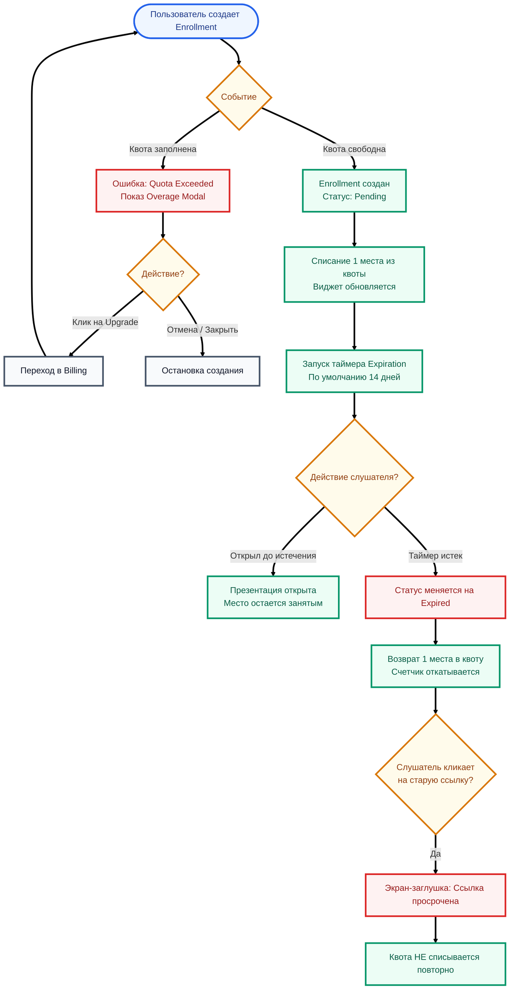

# Срок годности ссылки (Expiration Date) и Виджет Квот (Quota Widget): Логика и Use Cases

Этот документ описывает логику работы системы контроля назначений (Enrollments) простым языком, фокусируясь на том, как система помогает пользователю управлять своими лимитами и ссылками.

---

## 1. Базовый Workflow

Взаимодействие пользователя с лимитами и сроком действия ссылок строится по следующему циклу:

**Шаг за шагом:**
1. **Назначение и Квота:** При создании ссылки на презентацию (Enrollment) система резервирует 1 место (Seat) из общего пула квот пользователя. Виджет квот немедленно обновляет счетчик (например, 85/100).
2. **Отсчет времени (Expiration):** Каждой ссылке дается срок годности (по умолчанию 14 дней). Запускается невидимый таймер.
3. **Возврат квоты (Освобождение места):** Если клиент не открыл презентацию до истечения срока, ссылка сгорает (статус `Expired`). Зарезервированное место автоматически возвращается пользователю. Счетчик в виджете откатывается назад (становится 84/100).
4. **Предупреждение:** Если свободных мест остается мало (занято >= 90%), виджет меняет цвет и привлекает внимание, предлагая докупить места до того, как работа остановится.

### Блок-схема процесса (Flowchart)

---

## 2. Use Cases (Основные сценарии)

Система умеет гибко реагировать на активность клиентов и лимиты пользователя. Вот главные жизненные сценарии:

### Сценарий 1: Клиент забыл или ушел в отпуск (Срок годности)
* **Ситуация:** Пользователь отправил клиенту презентацию, но клиент ушел в отпуск на 3 недели и не кликнул по ссылке.
* **Действие системы:** Ровно через 14 дней система переводит назначение в статус `Expired`.
* **Результат для пользователя:** Место в квоте автоматически освобождается. Пользователь не платит за "мертвые" или забытые ссылки, его лимит не засоряется.

### Сценарий 2: Попытка открыть просроченную ссылку (Заглушка)
* **Ситуация:** Клиент вернулся из отпуска (прошло 20 дней) и кликнул по старой ссылке в почте.
* **Действие системы:** Вместо презентации клиент видит аккуратный экран-заглушку.
* **Текст на экране:** "Срок действия этой ссылки истек. Пожалуйста, обратитесь к отправителю для получения нового доступа." (The link has expired. Please contact the sender for a new access link).
* **Результат:** Просмотр не засчитывается, квота с пользователя повторно не списывается.

### Сценарий 3: Массовая рассылка и угроза лимиту (Желтая зона виджета)
* **Ситуация:** Лимит пользователя — 100 мест. Он сделал массовую рассылку и создал 92 назначения.
* **Действие виджета:** Виджет в шапке сайта (Quota Widget) окрашивается в предупреждающий оранжевый/красный цвет.
* **Текст виджета:** "Approaching limit! Upgrade" (Вы приближаетесь к лимиту! Увеличить квоту).
* **Результат:** Пользователь заранее предупрежден, что места заканчиваются. Клик по кнопке "Upgrade" бесшовно переводит его в раздел биллинга.

### Сценарий 4: Жесткая блокировка (Quota Exceeded)
* **Ситуация:** У пользователя занято 100 из 100 мест. Он пытается создать 101-ю ссылку для важного клиента.
* **Действие системы:** Процесс создания прерывается. Всплывает попап (Overage Modal).
* **Текст в попапе:** "Вы достигли лимита активных слушателей. Чтобы отправить эту презентацию, докупите дополнительные места или подождите, пока истечет срок действия старых ссылок."
* **Результат:** Пользователь может прямо из попапа перейти к покупке (Phase 3 Billing) и через минуту успешно отправить презентацию.

### Сценарий 5: Индивидуальные настройки для VIP-клиентов (Superadmin)
* **Ситуация:** Крупный корпоративный клиент (пользователь) жалуется, что его слушателям нужно больше времени на изучение материалов (цикл сделки 2 месяца).
* **Действие системы:** Супер-администратор заходит в панель управления и меняет дефолтный `Expiration Date` конкретно для этого клиента с 14 на 60 дней.
* **Результат:** Все новые ссылки этого клиента живут 60 дней, не требуя ручной настройки при каждой отправке.

---

## 3. Открытые вопросы (На обсуждение)

1. **Письма-уведомления (Email Alerts):** Нужно ли нам отправлять пользователю email, когда его виджет квот переходит в "красную зону" (90% заполненности)? Или достаточно визуального индикатора в интерфейсе?
2. **Кнопка "Продлить жизнь ссылки" (Renew Link):** Если ссылка перешла в статус `Expired`, стоит ли добавить в интерфейс кнопку "Продлить", которая в один клик сгенерирует новый срок годности и снова спишет квоту, без необходимости пересоздавать Enrollment с нуля?
3. **Запрос доступа от слушателя (Request Access):** На экране просроченной ссылки (Сценарий 2) стоит ли добавить кнопку "Запросить новый доступ", которая отправит уведомление владельцу презентации?
4. **Кастомизация срока при отправке:** Сейчас срок по умолчанию задается админом. Нужно ли в будущем дать самому пользователю (в модалке Share) ползунок выбора срока для конкретной ссылки (например, "Сжечь после 24 часов" или "Действительна 7 дней")?
