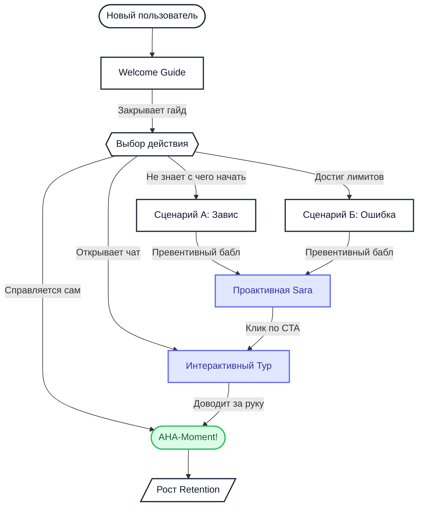

# Воронка вовлечения Sara AI (Business Workflow) для app.pitchavatar.com

Этот документ описывает бизнес-ценность и влияние интеллектуального ассистента Sara на ключевые метрики вовлеченности (Activation Rate, Churn Rate, LTV, Retention) на платформе **[app.pitchavatar.com](https://app.pitchavatar.com)**.

## 1. Бизнес-воронка (Customer Journey)

Ниже представлена схема взаимодействия онбординг-инструментов (Welcome Guide, Checklists) и проактивного ИИ-помощника Sara, которые в связке ведут пользователя к AHA-моменту (созданию первого успешного видеоролика):

---

## 2. Ключевые бизнес-метрики и влияние Sara AI

Интеграция Sara непосредственно в продукт решает несколько критических PLG (Product-Led Growth) задач:

### 1. Сокращение Time-to-Value (TTV)
* **Проблема:** Традиционный интерфейс создания видео-презентации содержит множество настроек (выбор аватара, голоса, написание текста, генерация, тайминги), что пугает нового пользователя, увеличивая время до первого запуска.
* **Решение Sara:** Переключает пользователя в интерактивный режим. Вместо самостоятельного поиска функций ИИ-помощник запускает туры Stonly, которые подсвечивают ровно ту кнопку, которую нужно нажать на данном шаге.

### 2. Снижение Churn Rate при ошибках генерации
* **Проблема:** Когда пользователь превышает лимит бесплатного тарифа при загрузке презентации или генерации голоса, он сталкивается с ошибкой и часто закрывает вкладку.
* **Решение Sara:** Error-триггер ловит системную ошибку "Quota Exceeded" или ошибку валидации и проактивно предлагает конструктивный выход (например, помочь сократить текст скрипта, чтобы он вписался в бесплатный тариф).

### 3. Автоматизация L1-поддержки (Support Cost Reduction)
* **Проблема:** До 40% запросов в поддержку на `app.pitchavatar.com` — это простейшие вопросы навигации («Где поменять голос?», «Как добавить логотип?», «Как поделиться ссылкой?»).
* **Решение Sara:** Отвечая через связку RAG (Help Center) + Stonly-туры, Sara решает эти вопросы мгновенно прямо в интерфейсе без привлечения операторов поддержки.

### 4. Влияние на Retention и вовлеченность
* Персонализированный бабл на основе `main_goal` (например, *Sales Demo*, *HR Onboarding*, *Video Translation*) точечно вовлекает пользователя в работу над конкретным бизнес-кейсом, повышая конверсию из регистрации в регулярное использование (Wau/Mau).
