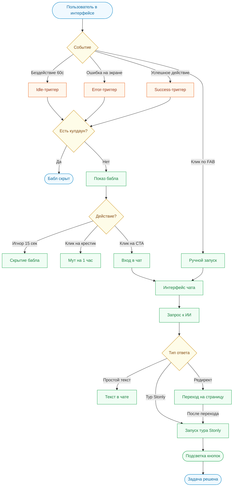

# Архитектура и Воркфлоу виджета Sara AI (app.pitchavatar.com)

Этот документ описывает логику работы интеллектуального помощника Sara для платформы **[app.pitchavatar.com](https://app.pitchavatar.com)**. Документ ориентирован на команду разработки и менеджмент, описывая логику взаимодействия, триггеры проактивности и сценарии использования простым языком.

## 1. Базовый Workflow (Схема взаимодействия)

Взаимодействие пользователя с Sara AI на сайте **[app.pitchavatar.com](https://app.pitchavatar.com)** строится по следующему циклу:

**Шаг за шагом:**
1. **Наблюдение:** Sara свернута в иконку (FAB) в правом нижнем углу и незаметно следит за поведением (простой, ошибки, успешные вехи).
2. **Инициатива:** При наступлении события-триггера всплывает бабл с контекстным вопросом и кнопкой (CTA).
3. **Вовлечение:** Клик по кнопке разворачивает чат.
4. **Помощь & Навигация:** При необходимости помочь с действием, Sara выполняет переход на нужную страницу и запускает интерактивный тур Stonly.

---

## 2. Основные сценарии (Use Cases)

В рамках **[app.pitchavatar.com](https://app.pitchavatar.com)** Sara поддерживает следующие ключевые сценарии:

### Сценарий 1: Пользователь завис в редакторе (Таймаут / Idle)
* **Страница:** `https://app.pitchavatar.com/create/video`
* **Ситуация:** Пользователь загрузил презентацию, но не производит никаких действий в течение 60 секунд.
* **Действие Sara:** Появляется бабл: *"Не знаете, что написать на слайде? Я могу сгенерировать скрипт на основе вашего текста." (Not sure what to write on this slide? I can generate a script based on your text.)*
* **Кнопка (CTA):** *"Создать скрипт" (Generate script)*
* **Результат:** Клик по кнопке запускает интерактивный тур Stonly по генерации ИИ-скрипта.

### Сценарий 2: Превышение лимита символов (Ошибка / Error)
* **Страница:** Везде, где генерируется аудио (например, `https://app.pitchavatar.com/create/video`)
* **Ситуация:** Пользователь пытается сгенерировать голос, но текст превышает лимиты тарифа (ошибка "Quota Exceeded").
* **Действие Sara:** Мгновенно всплывает бабл: *"Упс, кажется ваш текст превышает лимит. Хотите, я помогу сократить скрипт без потери смысла?" (Oops, it seems your text exceeds the limit. Want me to help shorten the script without losing its meaning?)*
* **Кнопка (CTA):** *"Сократить текст" (Shorten script)*
* **Результат:** Чат разворачивается с предзаполненным запросом на суммаризацию и сокращение текста.

### Сценарий 3: Успешная загрузка слайдов (Успех / Success)
* **Страница:** `https://app.pitchavatar.com/create/video`
* **Ситуация:** Слайды презентации успешно обработаны и отображены на экране.
* **Действие Sara:** Появляется бабл: *"Слайды успешно загружены! Самое время добавить к ним ведущего. Выбрать готовый аватар или загрузить ваше фото?" (Slides successfully loaded! Time to add a presenter. Choose a ready-made avatar or upload your photo?)*
* **Кнопка (CTA):** *"Выбрать аватар" (Choose avatar)*
* **Результат:** Запуск пошагового тура по выбору/настройке ИИ-ведущего.

### Сценарий 4: Вход с целью локализации (Контекст / Entry)
* **Страница:** `https://app.pitchavatar.com/create/video` (после перехода по баннеру "Translate any video")
* **Ситуация:** Пользователь заходит на страницу с конкретной целью перевода видео (main_goal = localization).
* **Действие Sara:** Всплывает бабл через 3 секунды после загрузки: *"Готовы перевести видео? Давайте выберем целевой язык и подходящий голос." (Ready to translate your video? Let's choose the target language and voice.)*
* **Кнопка (CTA):** *"Выбрать язык" (Choose language)*
* **Результат:** Запускается пошаговый тур Stonly по переводу контента.

### Сценарий 5: Настройка Chat-аватара (Таймаут / Idle)
* **Страница:** `https://app.pitchavatar.com/avatar/setup`
* **Ситуация:** Пользователь настраивает Chat-аватара, но не загружает базу знаний более 60 секунд.
* **Действие Sara:** Появляется бабл: *"Роль выбрана отлично! Но чтобы я могла отвечать на вопросы ваших клиентов, мне нужна база знаний. Загрузите PDF или добавьте ссылку." (Role selected perfectly! But to answer your clients' questions, I need a knowledge base. Upload a PDF or add a link.)*
* **Кнопка (CTA):** *"Показать как загрузить" (Show how to upload)*
* **Результат:** Запускается тур, подсвечивающий область загрузки документов/ссылок (Knowledge Base).

### Сценарий 6: Успешная генерация видео (Успех / Success)
* **Страница:** `https://app.pitchavatar.com/create/video` (по завершении рендеринга)
* **Ситуация:** Процесс рендеринга презентации завершён без ошибок.
* **Действие Sara:** Появляется бабл: *"Ваше видео готово и выглядит отлично! Хотите скопировать ссылку или отправить его на email?" (Your video is ready and looks great! Want to copy the link or send it via email?)*
* **Кнопка (CTA):** *"Поделиться видео" (Share video)*
* **Результат:** Подсвечиваются кнопки шаринга и копирования ссылок.

### Сценарий 7: Прямой вопрос в чат (Активный чат)
* **Страница:** Любая страница PitchAvatar
* **Ситуация:** Пользователь открывает чат вручную и задает вопрос.
* **Вопрос:** *"Как изменить голос аватара?" (How do I change the avatar's voice?)*
* **Ответ Sara:** *"Вы можете изменить голос в правой панели настроек. Давайте я покажу вам." (You can change the voice in the right settings panel. Let me show you.)*
* **Результат:** Автоматический запуск тура по смене голоса.

### Сценарий 8: Вопрос на главной, требующий перехода (Редирект + Тур)
* **Страница:** `https://app.pitchavatar.com/dashboard` (Главная панель)
* **Ситуация:** Пользователь на главной панели спрашивает: *"Как мне создать видеоролик из презентации?" (How do I create a video from a presentation?)*
* **Ответ Sara:** *"Давайте я перенаправлю вас в редактор и покажу, как это сделать!" (Let me redirect you to the editor and show you how to do it!)*
* **Результат:** Выполняется экшен `navigate` на роут `https://app.pitchavatar.com/create/video`, чат остается открытым, и после перехода автоматически запускается тур Stonly по импорту PDF/презентации.

---

## 3. Открытые вопросы для продакт-команды

1. **Список туров в Stonly:** Все ли сценарии (от 1 до 8) имеют соответствующие готовые туры в Stonly? Нам понадобятся их идентификаторы (ID) для конфигурации `src/widgets/Sara/config/tours.ts`.
2. **База знаний Help Center:** Планируется ли сквозное подключение статей из Zendesk/Intercom в RAG-модуль Sara?
3. **Tone of Voice:** Какую тональность выбрать по умолчанию (дружелюбная с эмодзи или строгая деловая)?
