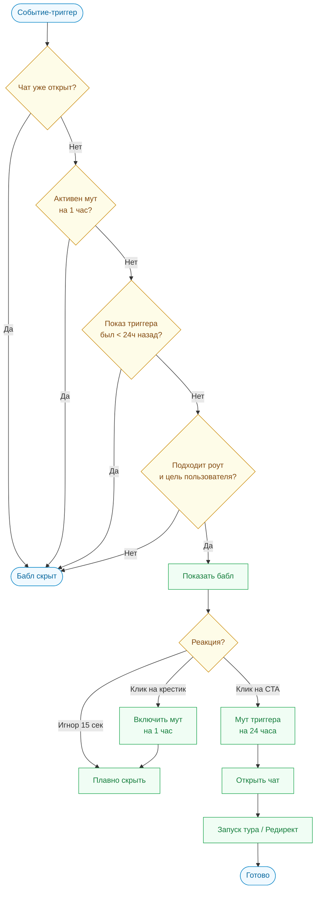

# Проактивная логика поведения Sara (Proactive Mode) на app.pitchavatar.com

Этот документ детально описывает логику работы **Проактивного режима (Proactive Mode)** ассистента Sara на платформе **[app.pitchavatar.com](https://app.pitchavatar.com)**. Проактивный режим позволяет ассистенту привлекать внимание пользователя контекстными вопросами и кнопками-действиями (CTA) в виде всплывающего бабла (ProactiveBubble) над иконкой FAB.

---

## 1. Общий Workflow вовлечения

Процесс взаимодействия строится по принципу прогрессивного вовлечения:

1. **Этап 1: Welcome Guide (Stonly)** — при первом входе на страницу открывается приветственный оверлей-гайд, объясняющий назначение раздела.
2. **Этап 2: Collapsed FAB** — после закрытия гайда виджет Sara сворачивается в иконку в нижнем правом углу экрана. Рядом может отображаться чеклист задач.
3. **Этап 3: Proactive Bubble** — при наступлении заданного события (например, простой 60 секунд), над FAB всплывает бабл с текстовым предложением и кнопкой.
4. **Этап 4: Expanded Chat & Tours** — при клике на бабл открывается чат Sara и автоматически запускается интерактивный тур Stonly, ведущий пользователя по кнопкам интерфейса.

---

## 2. Правила и кулдауны (Anti-Spam Logic)

Чтобы Sara оставалась полезной и не раздражала пользователей на `app.pitchavatar.com`, её поведение жестко контролируется системой кулдаунов (сохраняется в `localStorage`):

*   **Глобальный мут (Global Mute) — 1 час:** Если пользователь явно закрыл проактивный бабл, нажав на крестик, Sara блокирует появление проактивных сообщений на **1 час** по всему приложению.
*   **Кулдаун конкретного триггера — 24 часа:** Если конкретный сценарий (например, предложение помочь со скриптом) был показан, он не повторится для этого пользователя в течение **24 часов**.
*   **Приоритет активного диалога:** Проактивные баблы **никогда** не показываются, если виджет чата уже развернут (пользователь общается с ИИ).
*   **Автоматическое скрытие (Auto-dismiss) — 15 секунд:** Если пользователь не отреагировал на бабл, он плавно исчезает через 15 секунд, не перекрывая элементы интерфейса.

---

## 3. Типы триггеров (Triggers)

Логика отслеживания событий реализуется на фронтенде в виде React-хуков:

### A. Idle Trigger (Детектор простоя)
*   **Как работает:** Хук `useSaraIdleDetector` запускает таймер на 60 секунд. Любая активность пользователя (движение мыши, клик, нажатие клавиши) сбрасывает таймер.
*   **Цель:** Подсказать первый шаг пользователю, который завис на пустом экране.

### B. Error Trigger (Детектор ошибок)
*   **Как работает:** Хук `useSaraEventDetector` перехватывает тосты об ошибках или события API (например, лимиты символов, сбой загрузки файла).
*   **Цель:** Снять фрустрацию при ошибке и предложить обходной путь.

### C. Success / Milestone Trigger (Детектор успехов)
*   **Как работает:** Слушает события успешного завершения задач (например, `Slides_Loaded` или `Audio_Generated`).
*   **Цель:** Направить пользователя к следующему логическому действию.

### D. Context Entry Trigger (Вход по цели)
*   **Как работает:** Срабатывает через 3 секунды после открытия роута, если у пользователя установлена определенная цель в профиле (`main_goal`).
*   **Цель:** Дать быстрый персональный старт.

---

## 4. Алгоритм принятия решений (Схема логики)

Вся логика работы проактивного режима функционирует на клиенте и подчиняется следующему алгоритму проверки условий:

**Описание шагов алгоритма:**
1. **Первичный отсев:** Если окно чата Sara уже развернуто на экране, проактивный бабл автоматически блокируется, чтобы не перегружать интерфейс.
2. **Проверка глобального мута:** Если пользователь закрывал бабл крестиком менее 1 часа назад, показ отменяется.
3. **Проверка индивидуального кулдауна:** Если данный конкретный бабл (например, предложение помочь с презентацией) уже показывался пользователю в течение последних 24 часов, он пропускается.
4. **Контекстное соответствие:** Проверяется регулярное выражение текущего URL (роута) и бизнес-цель пользователя из профиля (`main_goal`). Если условия совпадают — бабл плавно выезжает на экран.
5. **Обработка действий:**
   * Если пользователь **игнорирует** бабл в течение 15 секунд — он просто исчезает.
   * Если нажимает **крестик** — запускается глобальный кулдаун на 1 час для всех баблов.
   * Если нажимает **кнопку действия (CTA)** — запускается кулдаун на данный триггер на 24 часа, чат разворачивается, и запускается ассоциированный тур Stonly (или совершается переход на нужный URL).

