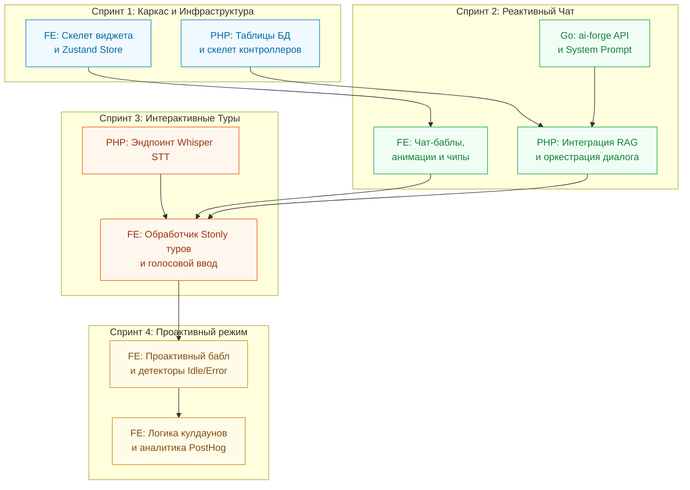

# План реализации виджета Sara (Implementation Workflow) на app.pitchavatar.com

Этот документ описывает дорожную карту (Roadmap) внедрения ИИ-ассистента Sara на платформе **[app.pitchavatar.com](https://app.pitchavatar.com)**. Внедрение разделено на 4 логических спринта, что обеспечивает независимую параллельную работу фронтенда, бэкенда (PHP) и микросервиса (Go).

## 📊 Зависимости и этапы разработки

---

## 📅 Спринт 1: Архитектурный скелет и инфраструктура (Skeleton & Infra)
* **Цель:** Настройка фича-флагов, подготовка Zustand-хранилища на фронтенде, создание таблиц БД и эндпоинтов-пустышек на бэкенде.

### 💻 Frontend (React / Zustand)
* **Задача F1:** Разработка каркаса виджета `SaraWidget` (свернутая кнопка FAB, открытое диалоговое окно).
* **Задача F2:** Интеграция Zustand-стейт-менеджера (`useSupportChatStore`) с поддержкой локального сохранения истории сообщений.
* **Задача F3:** Ленивая загрузка виджета (`next/dynamic`) в корневом `layout.tsx` под фича-флагом PostHog `chat-avatar-support`.

### 🗄️ Backend (PHP / Laravel)
* **Задача P1:** Создание конфигурационного файла `config/sara.php` и миграция для хранения истории сообщений `sara_messages` (id, user_id, message, is_ai, created_at).
* **Задача P2:** Создание `SaraController` и 5 базовых роутов-заглушек в `routes/api.php` под защитой Sanctum.

---

## 📅 Спринт 2: Реактивный режим и интеграция LLM (Reactive Core Chat)
* **Цель:** Запуск полноценного чата, обработка текстовых запросов через ИИ (microservice `ai-forge`) и интеграция с базой знаний (RAG).

### 🤖 Go Microservice (ai-forge)
* **Задача M1:** Разработка эндпоинта `POST /v1/sara/chat`. Настройка System Prompt, подключение RAG-контекста, разметка инструментов (tools) и валидация схемы JSON-ответа `{reply: string, actions: Array}`.

### 🗄️ Backend (PHP / Laravel)
* **Задача P3:** Разработка сервиса `SaraService` (оркестрация: чтение истории -> запрос в RAG -> отправка в `ai-forge` -> сохранение и валидация ответа).
* **Задача P4:** Индексация базы знаний Help Center и передача в RAG-сервис.
* **Задача P5:** Реализация бэкенд-эндпоинтов истории чата (`GET /messages`) и отправки сообщений (`POST /chat`).

### 💻 Frontend
* **Задача F4:** Стилизация областей ChatBubble, Input Panel, а также добавление индикаторов набора текста (Typing indicator) и микро-анимации аватара (pulse effect).
* **Задача F5:** Динамическая загрузка Suggested Chips (подсказок) при загрузке страницы с возможностью циклической пагинации (кнопка Refresh ↺).

---

## 📅 Спринт 3: Интерактивные туры Stonly и голосовой ввод (Interactive Action Engine)
* **Цель:** Обучение ассистента запуску туров Stonly на основе команд от ИИ, поддержка голосового ввода (STT) и переходов (Redirects).

### 🗄️ Backend (PHP / Laravel)
* **Задача P6:** Создание эндпоинта транскрибации речи в текст `POST /api/sara/voice` на основе интеграции с Whisper API.

### 💻 Frontend
* **Задача F6:** Разработка хука-диспетчера `useSaraActions.ts` для разбора команд от ИИ:
  * `start_tour` -> вызов `window.StonlyWidget('openGuide', { guideId })`.
  * `navigate` -> вызов роутера для смены страницы с последующим автоматическим запуском нужного тура.
* **Задача F7:** Реализация голосового ввода (MicButton) с записью звука через `MediaRecorder` и отправкой аудио на бэкенд.
* **Задача F8:** Оптимизация под мобильные устройства: принудительное сворачивание окна чата при запуске интерактивного тура, чтобы не перекрывать подсказки.

---

## 📅 Спринт 4: Проактивный режим и полишинг (Proactive Triggers & Release)
* **Цель:** Реализация движка отслеживания событий (Idle, Error, Success), настройка анти-спам кулдаунов и запуск A/B тестирования.

### 💻 Frontend
* **Задача F9:** Разработка всплывающего бабла `ProactiveBubble` над кнопкой FAB с визуальной анимацией появления.
* **Задача F10:** Реализация хуков-детекторов активности `useSaraIdleDetector` (простой 60 сек) и ошибок `useSaraEventDetector` (перехват системных сбоев).
* **Задача F11:** Разработка логики кулдаунов (сохранение меток в `localStorage`): блокировка проактивных сообщений на 1 час при закрытии крестиком и на 24 часа для конкретного триггера.
* **Задача F12:** Запуск поэтапной раскатки через PostHog (10% -> 25% -> 50% -> 100%) и мониторинг метрик активации.
