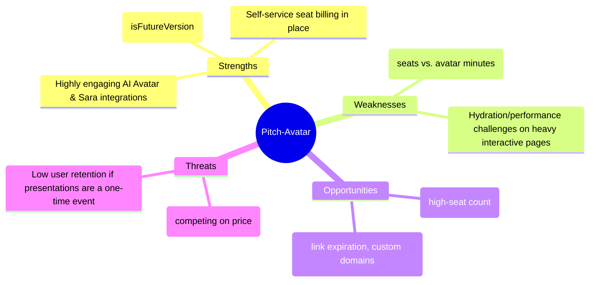

# Strategic Session Preparation Guide: Pitch-Avatar

This document is compiled to help you prepare for tomorrow's management strategic session. It summarizes the product's current capabilities, identifies key strategic forks in the road, proposes a SWOT analysis, and outlines discussion topics to align the team.

---

## 1. Product Context & Current Architecture

Our latest iteration introduced a powerful architectural mechanism: **Feature Toggling (`isFutureVersion`)**. This allows us to maintain a stable, simple product for current clients while having a fully developed, high-tier corporate version ready for a toggle-switch release.

### Recent Milestones Implemented:
* **Listener-Based Quota Management**: Shifted focus from "unlimited links" to "active enrollment seats" (`activeCount` vs `maxSeats`).
* **Self-Service Expansion**: Built-in billing calculators with volume discounts ($10/seat scaling to $8/seat for >100 seats).
* **Corporate Guardrails**: Admins can set quotas per user, and users are automatically warned/blocked via the `OverageModal` when they exceed active seats.
* **Link Expiration Controls**: Foundations for lifecycle management of presentation links (14-day default or custom expiration).
* **Sara AI Agent**: Active work on interactive, proactive voice and chat elements (`SaraStore`, `ProactiveBubble`, `ChatPanel`) to engage listeners during presentations.

---

## 2. Key Strategic Decisions (Discussion Points)

During the session, the management team should align on the following three pillars:

### 💡 Pillar A: Monetization Metrics (What are we charging for?)
We currently track multiple metrics: *Team Seats*, *AI Avatar Minutes*, *Chat Avatar Minutes*, and *Listeners with Enrollments*.
* **Discussion Question**: Is "Active Listener Seats" the right primary growth metric?
  * *Option 1: Seat-based (current plan)*: Customers pay for the number of active invitees. (Predictable, enterprise-friendly).
  * *Option 2: Consumption-based (AI minutes used)*: Customers pay for the time the AI avatar spends presenting. (High margin, but harder for customers to budget).
  * *Option 3: Hybrid model*: Base plan includes X seats and Y minutes, overages billed separately.

### 🤖 Pillar B: The Role of "Sara" (Product Differentiation)
Pitch-Avatar isn't just a slide viewer; it has interactive AI elements.
* **Discussion Question**: How do we position "Sara" to increase product stickiness?
  * Should Sara be a premium add-on, or a core differentiator available to all tiers?
  * How do we measure the ROI of Sara engagement (e.g., does interactive chat increase presentation-to-sale conversion rates)?

### 🔒 Pillar C: Link Expiration & Security
We built the default link expiration limits (14 days).
* **Discussion Question**: Is link expiration a security feature (compliance/privacy) or a resource-saving feature?
  * If it's a security feature, we should upsell custom expiration durations as an Enterprise-only tier benefit.

---

## 3. SWOT Analysis: Pitch-Avatar

---

## 4. Suggested Agenda for the Strategic Session

| Time | Block | Goal |
| :--- | :--- | :--- |
| **09:00 - 09:30** | **Retrospective & Current Tech State** | Show that the foundations for quota controls, billing tabs, and the toggle system are complete. |
| **09:30 - 10:30** | **Pillar A: Monetization & Pricing Fit** | Agree on the pricing tiers ($10/$8 volume discount) and review customer feedback on limits. |
| **10:30 - 11:30** | **Pillar B: Sara & AI Roadmap** | Align on features for the AI avatar assistant and interactive chat experience. |
| **11:30 - 12:30** | **Roadmap Prioritization** | Score upcoming features using the `product-feature-prioritization` guidelines (RICE/MoSCoW). |

---

## 5. Critical Questions to Ask Your Team

1. **To the Engineering Team**: 
   * *"Are we ready to switch the toggle `isFutureVersion` to `true` for a cohort of beta users? What is the database migration risk?"*
2. **To the Sales/Marketing Team**:
   * *"Is $10/seat a friction point for our small-business segment? Should we introduce a lower starter tier (e.g., 5 seats for $19/mo)?"*
3. **To the Customer Success Team**:
   * *"What is the main reason customers let their presentation links expire? Do they need templates or better analytics?"*
